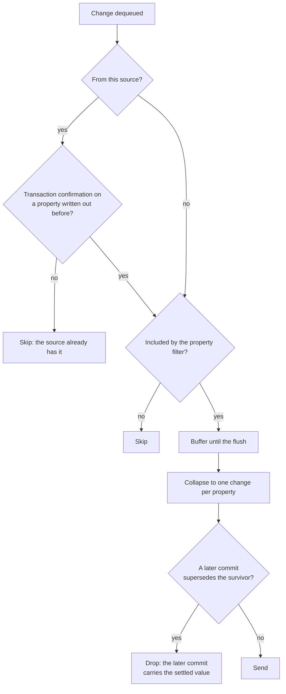

# Connectors

The `Namotion.Interceptor.Connectors` package provides infrastructure for bridging your subject graph to external systems, syncing property values in and out over protocols like OPC UA, MQTT, or WebSocket. Every connector falls into one of two categories, defined by **data ownership**:

| Type                   | Data Owner      | Typical Role                            | Base                                                 |
|------------------------|-----------------|-----------------------------------------|------------------------------------------------------|
| **Source** (Client)    | External system | Client connecting to an external system | `SubjectSourceBase` (`ISubjectSource`)               |
| **Connector** (Server) | Local model     | Exposing subjects to external clients   | `SubjectConnectorBase` (`ISubjectConnector`)         |

In practice, sources act as network clients and servers act as network servers, but this is a convention, not a requirement. The defining distinction is which side owns the data.

### Protocol-specific documentation

- [WebSocket](connectors-websocket.md) - Bidirectional WebSocket protocol for real-time synchronization
- [MQTT](connectors-mqtt.md) - MQTT client/server integration for IoT scenarios
- [OPC UA](connectors-opcua.md) - OPC UA client/server integration for industrial automation ([Client](connectors-opcua-client.md) | [Server](connectors-opcua-server.md) | [Mapping](connectors-opcua-mapping.md))
- [Subject Updates](connectors-subject-updates.md) - Wire format for serializing subject state
- [Source Monitoring](connectors-monitoring.md) - Synchronization state, waits, and the source event stream

## Sources

A **source** represents an external authoritative system where the data originates. The local model is a **replica** that synchronizes with this external source of truth.

**Examples**: OPC UA client connecting to a PLC, MQTT client subscribing to a broker, database client, REST API consumer

**Single-owner rule**: Each property can be associated with at most one source. Sources are responsible for claiming and releasing ownership of the properties they manage. This happens initially by scanning the subject graph during startup, and dynamically when the model changes structurally (subjects attached or detached via lifecycle events). Dynamic ownership changes require the external system to support adding and removing subscriptions at runtime. You can retrieve the source that currently owns a property with `TryGetSource()`, for example to check connection status or access protocol-specific features.

### Data Flow

#### Inbound (External → Subject)

When the external system sends new values:

1. External system sends update
2. Source receives the update
3. Source calls `propertyWriter.Write()`
4. Subject property is updated

#### Outbound (Subject → External)

When you change a property value in code, the **local model is updated immediately**. These are regular C# property setters. The change is then picked up by the change queue and written to the attached source **asynchronously** in the background:

1. Property setter writes the new value to the backing field (immediate)
2. Change notification is enqueued
3. Background service dequeues the change and calls `WriteChangesAsync()` on the source
4. Source sends the update to the external system

This means the local model and the external system can be temporarily inconsistent. If the source write fails (network error, validation on the remote system), the local model already has the new value. The write retry queue handles transient failures by buffering and retrying, but the local model is always ahead of the external system.

For **servers**, the pattern is similar: local writes are applied immediately, then eventually pushed to connected clients.

#### Source-First Writes with Transactions

If you need the external source to accept the change *before* updating the local model, use source transactions. This inverts the write order so the source confirms before the local model changes. See [Write Consistency Guarantees](#write-consistency-guarantees) for a comparison of both approaches and [Transactions](tracking-transactions.md) for full details.

### Initialization

Sources use a buffer-load-replay pattern during initialization and reconnection:

1. **Buffer**: During source startup (the base calls `StartListeningAsync` on the source after `StartBuffering`), inbound updates are buffered
2. **Load**: `LoadInitialStateAsync()` fetches complete state from external system
3. **Replay**: Buffered updates are replayed in order after initial state is applied
4. **Reconcile queued writes**: Writes parked while connecting are decided by commit order and sent, unless a later local write superseded them (see [Write Retry Queue](#write-retry-queue))

This ensures:
- Updates received during initialization are not lost
- Updates are applied in the correct order relative to the initial state
- Queued writes are reconciled by commit order rather than discarded

Writes made while the source is connecting are captured, not lost. The outbound subscription is created once for the whole source lifetime, before the retry loop, so a connect-window or reconnect-delay write cannot fall into a gap.

**What gets parked**, by change origin (see [Change notification source semantics](#change-notification-source-semantics)):

- Writes to properties this source owns, whatever produced them.
- Not this source's own inbound applies, so a value it sent is never echoed back. The one exception is a transaction confirmation on a property a connector has written out, which has to reach the source to repair it.

**What happens when draining starts.** Each parked write is decided by commit order, the same rule as [Change Batching and Merging](#change-batching-and-merging):

- Superseded by a later local write: dropped, because that later write is delivered in its place.
- Otherwise: sent, restored locally first if the initial-state load moved the model off it.

**A local write that has already committed wins over the value the load brought in.**

### Why the source does not always win

The source is authoritative for a property it owns, and normally it does win: an inbound value with no local write pending is applied and produces no outbound write. Two cases break that, and they share a cause. A value arriving from the source cannot be ordered against a local write that has already committed, because it is stamped when we apply it, not when the source produced it (issue #373):

- **An echo.** The source reporting back a value we just wrote is an acknowledgement, not newer truth. Letting it win discards the write that followed it.
- **The initial-state load.** It carries the source's state as of the connect, which says nothing about whether it precedes or follows a write made moments earlier.

In both, "source wins" would resolve an ambiguity by discarding a write that already committed locally, with no error and no way for the caller to know. So a committed local write wins instead, and the source converges to it.

**What keeps the two ends in sync** is not the conflict rule but the delivery path: the newest local commit is never dropped, so the source always receives the model's settled value, and the source's notifications carry its own value back, so the model converges to what the source holds. A source that neither reports values back nor answers reads is outside that guarantee; see the last limitation below.

**Servers are the opposite case.** A client's write to a server is not a value produced before it saw ours, it is the newer write, so the ordering ambiguity above does not exist and it does win over an older local commit. Delivering the older one instead would leave every client on a value the model has moved past. The three servers select this with `ChangeDeliveryRule.SourceValuesAreSettled`, whose documentation gives the precondition to check before adding a fourth.

### Write Consistency Guarantees

Property writes to sources follow a **local-first** model: the local property is updated immediately, and the change is sent to the source asynchronously. This means the local model and the source can be temporarily out of sync.

| Scenario | Local Model | Source | Outcome |
|---|---|---|---|
| Write succeeds | Updated immediately | Updated via async write | In sync |
| Write fails, retry succeeds | Updated immediately | Updated on retry | Eventually in sync |
| Disconnect + reconnect, source unchanged | Initial state restores source state, retry re-applies change | Receives change via fresh write | In sync |
| Disconnect + reconnect, source changed | Queued write restored locally | Receives the queued write | In sync (local write wins) |
| Write during connect, source leaves the property alone | Local write kept | Sent as a fresh write once draining starts | In sync |
| Write during connect, initial state overwrites the property | Local write restored | Receives the local write | In sync (local write wins) |
| Queued write superseded by a later local write | Later write kept | Receives only the later write | In sync |

In all cases the local model and the source converge. Once a write is parked and its property is owned by the source, it is never discarded in favour of an inbound value, so in the reconnect rows the source ends up with the local write rather than the value it held during the outage. [Known Limitations](#known-limitations) lists the remaining exceptions, including properties the source has not claimed yet and properties with no setter. A write is only dropped when a *later local* write supersedes it, and that later write is delivered in its place. Source-wins still applies wherever no local write is pending: an inbound value is accepted and produces no outbound write.

The table describes a connector talking to a remote source. A server also drops a write superseded by a client's write, since that write is the newer one; see [Why the source does not always win](#why-the-source-does-not-always-win). Convergence is unaffected, because the superseding value is the one the clients already have.

#### Confirmed writes with transactions

If you need the source to accept a change **before** updating the local model, use [source transactions](tracking-transactions.md). With transactions, the source is written first during commit. The local model is only updated if the source accepts the change. If the source is unreachable, the commit fails and the local model remains unchanged.

```csharp
var context = InterceptorSubjectContext
    .Create()
    .WithFullPropertyTracking()
    .WithTransactions()
    .WithSourceTransactions();

using var tx = await context.BeginTransactionAsync(TransactionFailureHandling.Rollback);
sensor.Temperature = 42.0m; // Captured, NOT applied locally yet
await tx.CommitAsync(ct);   // Writes to source first, then applies locally
                            // If source rejects → local model unchanged
```

| Approach                 | Local update          | Source guarantee             | On disconnect                    |
|--------------------------|-----------------------|------------------------------|----------------------------------|
| Without transactions     | Immediate             | Eventual (async + retry)     | Reconciled by commit order, local write wins |
| With source transactions | After source confirms | Confirmed before local apply | Commit fails, local unchanged    |

Choose based on your consistency requirements: local-first for responsiveness, transactions for confirmed delivery.

#### Change notification source semantics

The `Origin` of a change notification is typed (`ChangeOrigin`): `FromSource` when an inbound update stored exactly the value the source sent, `Confirmed` when a source transaction commit stored the value the source acknowledged, and `Local` for everything else. A change carries a source only when its stored value is exactly the value that source sent or confirmed. The outbound change queue skips changes whose origin source is the target source itself, so a committed value is normally written to its source exactly once, by the commit. The exception is a transaction confirmation on a property a connector has already written out, which is sent again to repair the source; see [Change Batching and Merging](#change-batching-and-merging).

Origin is stamped per write at the apply call (`SetValueFromSource`, `ApplySubjectUpdate` with a `FromSource` origin, transaction commit replay). Nothing inherits it: hook cascades, `INotifyPropertyChanged` handler write-backs, derived property recalculations, and lifecycle handler writes are all `Local` and therefore flow to bound sources like any local write. When an `OnChanging` hook or a write interceptor changes the incoming value during a stamped write, the stored value no longer equals the sent value and the write publishes as `Local`, so corrections flow back to the source. Transforms must be projections (idempotent, like clamping); reference-typed values must be reassigned, not mutated in place, to be detected.

Provenance-aware validators receive the origin via `PropertyValidationContext` and can treat source values as authoritative while strictly validating local input.

A write's origin moves through a lifecycle: it starts as a pending stamp set by the apply call (`SetValueFromSource`, `ApplySubjectUpdate`), becomes the attempted origin carried by the write while interceptors and validators run (this is what `PropertyValidationContext.Origin` exposes), and is finalized at the actual write, where a stamped origin whose stored value does not equal the sent value is demoted to `Local`; published changes always carry the finalized origin.

### Change Batching and Merging

A source with a `bufferTime` above zero batches outbound changes and collapses each flush to one change per property, so `WriteChangesAsync` sees at most one entry per property per flush.

**What a connector can rely on:**

- At most one change per property per flush, spanning the batch: the survivor's old value is the oldest in it and the new value the newest, whatever order they arrived in.
- The survivor's `Revision`, `Origin` and timestamps all come from the newest commit in the batch, so keying off `Origin.Source` sees the newest commit's origin. The exception is a batch containing a change built outside a write terminal, which carries no revision: the property then collapses by arrival position and the survivor carries no revision either, so it is always delivered.
- Emit order is the arrival order of each property's last occurrence.
- Only a property's settled state is delivered. A change the model has already moved past is dropped rather than sent, decided by commit order rather than by comparing values, so it holds for derived and runtime-registered properties too. Which commits count as moving the model past a change is not the same for every connector: see the rule below, because for a connector talking to a remote source a value that source sent does not count.
- Values a source itself sent are not echoed back to it. The one exception is a transaction confirmation on a property a connector has also written, which is sent to repair the source.

**The coalescing contract:** buffered delivery coalesces every change. At `bufferTime` zero it depends on the rule: a connector talking to a remote source coalesces only what was queued before processing started, so **a source that needs every intermediate value must run without buffering**, while a server keeps dropping superseded changes because it must not serve a value the model has moved past. The asymmetry is deliberate: a change queued before processing started was captured while the source was connecting, so a superseded one is stale state, whereas a change arriving afterwards is stream data, where an intermediate value is data rather than staleness.

What happens to a change, from dequeue to write:



The echo and property-filter checks happen as each change is dequeued, and so does a supersession check for anything queued before processing started. The collapse and the flush-time supersession check happen at the flush, which a zero buffer time skips: there each change is written as it is dequeued, and a server still drops superseded ones while a wire connector does not. A transaction confirmation being written back passes the same checks, so it can still be dropped if a later commit superseded it.

Which commits count as superseding is not the same for every connector, and choosing wrongly loses data in both directions. Connectors talking to a remote source may not rank against a value that source sent; servers must. See `ChangeDeliveryRule` and [connector delivery](design/connector-delivery.md) for the condition that decides it.

Revisions are monotonic per subject and are not comparable across subjects; see [Delivery Guarantees](tracking.md#delivery-guarantees) for the full contract, including what the old value does and does not promise.

If a transaction repair write fails, the source keeps the older value and the subject the confirmed one, so the two stay out of sync. Sources are built with a [write retry queue](#write-retry-queue) by default, which retries it, but that queue is a ring buffer and drops its oldest entries when full, so a pending repair can be evicted when writes fail across many properties at once. With the queue disabled the change is logged and dropped. There is no active reconciliation in either case: the divergence lasts until the property is written again or the source reloads its initial state on reconnect.

### Write Retry Queue

`SubjectSourceBase` provides a write retry queue that buffers writes during disconnection. Each connector exposes the queue size through its own configuration (for example, `OpcUaClientConfiguration.WriteRetryQueueSize`); when implementing a custom source, pass `writeRetryQueueSize` to the `SubjectSourceBase` constructor (default: 1000, pass 0 to disable retention). A capacity of 0 keeps the queue as the ownership and diagnostics boundary but retains no writes: failed and owned connect-window writes are warned about and counted as dropped instead.

**Behavior:**
- Ring buffer semantics: oldest writes dropped when capacity reached
- Complete accounting at capacity 0: owned writes that cannot be retained are counted by `Diagnostics.OutboundRetries.TotalDropped`; writes made before the source claims their property remain unattributable and are listed under [Known Limitations](#known-limitations)
- Memory while disconnected is bounded per connection attempt: the change subscription is drained into this queue before each attempt and again after the initial state is applied, so repeated failed attempts do not compound. Within one attempt the initial-state load is drained on a timer as well, so what accumulates without a bound is the retry delay and `StartListeningAsync`, and peak memory follows the write rate times the length of those two legs
- Automatic retry when `WriteChangesAsync` fails during normal operation
- Re-apply on reconnection by commit order: after loading initial state, each queued change is kept unless a later *local* write superseded it, in which case that later write is delivered instead. A kept change is sent as a fresh write, restored locally first if the load moved the model off it. Values the load brought in do not supersede a write that already committed, because the load cannot be ranked against it.
- In-memory only: queued writes are lost on process restart

### Flushing On Stop

When a connector attempt ends, the change processor hands whatever it had buffered but not yet flushed to the normal delivery owner. A source gives the batch to the retry queue above, while a server broadcasts it to the clients still connected. A failed reconnect attempt can leave the source batch parked for the next attempt. On final connector stop the retry owner is retired instead: pending and still-unconfirmed writes are cleared and counted in `Diagnostics.OutboundRetries.TotalDropped`. Without this handoff the batch would be lost silently because it has already left the change subscription that feeds the retry queue.

The cost is that a stop can block on an unreachable endpoint. Final delivery and the source retry handoff share one internal five-second safety bound, which cannot be configured per connector. Connectors stop one after another under the host's shared `HostOptions.ShutdownTimeout` of 30 seconds by default, so the host timeout must leave enough time for every connector to complete or reach its internal bound.

The batch is one more write through the normal handler, not a privileged one, so for a source the handler flushes the write retry queue first: that backlog holds older commits and must keep its place in commit order. A deep backlog on a slow transport can consume the whole bound on its own. At final stop, every write still owned when that happens is counted as locally unconfirmed; the remote side may already have accepted it or may still accept it, so teardown delivery is at least once.

### Monitoring Synchronization State

Every source reports whether it is connecting, synchronized, or stopped, through a per-tree registry, a typed event stream, and an awaitable wait. Add `WithSourceMonitoring()` to the context recipe to enable it:

```csharp
var context = InterceptorSubjectContext
    .Create()
    .WithFullPropertyTracking()
    .WithRegistry()
    .WithSourceMonitoring(builder.Services);
```

See [Source Monitoring](connectors-monitoring.md) for waiting on synchronization, reading per-property state, and the event stream. That answers whether the model can be trusted; what the transport itself is doing is [Connector Diagnostics](#connector-diagnostics).

### Inbound Update Error Handling

When an inbound update fails to apply, the failure is logged and the update is dropped. There is no retry: writes to the local model are deterministic, so they either succeed or fail consistently and retrying would not help. This includes custom validation failures.

`SubjectPropertyWriter` logs `Failed to apply subject update` once per update, not once per failed property. Beyond that each connector decides: the WebSocket server also answers the client with an error frame, and a source's initial state load lets the exception propagate so its reconnect and reload retry the whole snapshot.

Connectors applying a `SubjectUpdate` get per-property containment within one update, described in [When a Property Fails to Apply](connectors-subject-updates.md#when-a-property-fails-to-apply). One writing values property by property sets its own granularity instead, as the OPC UA and MQTT clients do by catching around each write.

This differs from outbound changes (writing from local model to external system), which use a retry queue to handle transient failures.

### Implementing a Source

All sources inherit from `SubjectSourceBase`, a `BackgroundService` that owns the full pump lifecycle. You override three hooks:

| Hook                    | Data Flow          | Description                                                                             |
|-------------------------|--------------------|-----------------------------------------------------------------------------------------|
| `StartListeningAsync`   | External → Subject | Connect to the external system and start receiving changes via `propertyWriter.Write()` |
| `LoadInitialStateAsync` | External → Subject | Fetch complete state snapshot for initialization                                        |
| `WriteChangesAsync`     | Subject → External | Send local property changes to the external system                                      |

The base class handles everything else: retry loop with backoff, buffering during initialization, change queue processing, write batching, and the write retry queue.

#### Pump Lifecycle

Each iteration of the sealed `RunAsync` runs the following sequence. On failure, the base disposes the listen lifetime, waits `retryTime` (default 10s), and restarts from the top. Only `OperationCanceledException` when the host stopping token is cancelled exits the loop. All other exceptions (including internal protocol timeouts) trigger a retry.

```
RunAsync
 ├── create source-lifetime subscription  ← captures local writes continuously (no gap across reconnects)
 └── retry loop (per connection attempt)
      ├── Task.Delay(retryTime)            ← retries only; the subscription keeps capturing during the wait
      ├── drain owned writes → retry queue ← park writes captured since the last attempt (caps memory)
      ├── StartBuffering()
      ├── StartListeningAsync()            ← your hook: connect + spawn monitor
      ├── LoadInitialStateAndResume()      ← calls your LoadInitialStateAsync, then replays buffer
      ├── drain owned writes → retry queue ← park connect-window writes
      ├── ReconcileRetryQueueAsync()       ← restore / send / drop queued writes vs current state
      ├── new ChangeQueueProcessor()       ← connected phase; reuses the source-lifetime subscription
      └── ProcessAsync()                   ← drains changes, calls your WriteChangesAsync
```

"Owned writes" are changes to properties bound to this source whose origin source is not this source; a change stamped with a different source is parked like any other. The source's own applies are skipped at drain and in the connected phase, so inbound values are not echoed back, except for a transaction confirmation on a property a connector has written out (see [Change notification source semantics](#change-notification-source-semantics)).

#### ISubjectSource Interface

`SubjectSourceBase` implements `ISubjectSource`; its abstract `WriteChangesAsync` and `LoadInitialStateAsync` satisfy the interface members directly.

```csharp
public interface ISubjectSource : ISubjectConnector
{
    int WriteBatchSize { get; }
    ValueTask<WriteResult> WriteChangesAsync(
        ReadOnlyMemory<SubjectPropertyChange> changes,
        CancellationToken cancellationToken);
    Task<Action?> LoadInitialStateAsync(CancellationToken cancellationToken);

    SourceState State { get; }
    DateTimeOffset StateChangeTime { get; }
    DateTimeOffset? LastSynchronizedAt { get; }
    new SourceDiagnostics Diagnostics { get; }
    event EventHandler<SourceEvent>? StateChanged;
}
```

Direct interface implementation without the base class is supported for advanced scenarios, but the implementer is then responsible for its own listening loop, buffering, and outbound dispatch, as well as the four synchronization-state members. See the XML docs on `ISubjectSource` for their exact contract, including the lock-free requirement on `RootSubject`/`State`/`StateChangeTime`/`LastSynchronizedAt` and the obligation to register with every reachable `SourceMonitor`.

A direct implementer needs **two** diagnostics members, not one, because C# has no covariant implicit interface implementation: the property that satisfies `ISubjectSource.Diagnostics` cannot also satisfy `ISubjectConnector.Diagnostics`, so the base interface's member is implemented explicitly and forwards to it.

```csharp
private readonly SourceMetrics _metrics = new();

public SourceDiagnostics Diagnostics { get; }

ConnectorDiagnostics ISubjectConnector.Diagnostics => Diagnostics;

public MySource() => Diagnostics = new SourceDiagnostics(_metrics);
```

The `SourceMetrics` instance is the writable side and stays private to the source: it is what the source calls `MarkStarted()`, `MarkOperational()`, `ReportError()` and the queue registrations on, and nothing outside the source can reach it through the returned view. See [Connector Diagnostics](#connector-diagnostics).

A direct source may register `ClaimedPropertyCount`; registering it is required only when the source must expose a non-null ownership count. A registered gauge can measure zero, while an unregistered gauge remains `null`. A direct source must register all queue gauges it owns: `OutboundChanges`, `OutboundRetries`, and `InboundBuffer`. Give a disabled queue a capacity of `0`; use a `null` capacity only when the queue is actually unbounded. If the source owns custom `IResettableMetrics` instances, register each one once before `MarkStarted()` so its totals join the run's first epoch.

Deriving from `SubjectSourceBase` instead gets both members, the start epoch, the recording of a failed connect attempt, and the terminal handling of any liveness the derived source has published. **Publishing liveness is the derived class's job**: the base never calls `MarkOperational()` or `MarkNotOperational()`, because each protocol becomes usable or unavailable at different points and those points are what `IsOperational` means for that connector. Calling either method opts the source into liveness reporting. A simple source that calls neither exposes `IsOperational == null` for as long as it runs, while its `State` can still reach `Synchronized`, and `false` once it stops. The three in-tree clients show where to put the calls: the MQTT client reports serving once `ConnectAsync` returns, the WebSocket client once the server's Welcome has been accepted, and the OPC UA client only once a session it has already created is confirmed usable, which is several steps later and which step depends on how that session came about (see [OPC UA Client](connectors-opcua-client.md#diagnostics)). Each reports the explicit down value from the path that detects the loss.

`StateChangeTime` and `LastSynchronizedAt` are both required, and neither can answer the other's question. `StateChangeTime` moves on every transition, so read with `State` it says how long the current state has lasted: `Synchronizing` plus T reads as stale since T. `LastSynchronizedAt` is stamped only on the way into `Synchronized` and never cleared, so it says whether a good period ever began, and it cannot say when synchronization was lost.

`LastSynchronizedAt` is load-bearing rather than diagnostic: branch waits use it to tell a source that stopped having delivered from one that stopped having never delivered. An implementation that reaches `Synchronized` must stamp it and never clear it, or every branch it participates in reports `Incomplete` once it stops. See [Source Monitoring](connectors-monitoring.md).

#### Custom Source Example

Derive from `SubjectSourceBase` and override the three hooks. The base owns the pump lifecycle (buffer, listen, load initial state, run change queue, retry on failure) and satisfies `ISubjectSource` directly through its public abstract members.

```csharp
public sealed class DatabaseSource : SubjectSourceBase
{
    private readonly IInterceptorSubject _root;

    public DatabaseSource(
        IInterceptorSubject root,
        IInterceptorSubjectContext context,
        ILogger<DatabaseSource> logger)
        : base(context, logger)
    {
        _root = root;
    }

    public override IInterceptorSubject RootSubject => _root;

    public override int WriteBatchSize => 100;

    protected override async Task<IAsyncDisposable?> StartListeningAsync(
        SubjectPropertyWriter propertyWriter,
        CancellationToken cancellationToken)
    {
        var connection = await OpenDatabaseConnectionAsync(cancellationToken);

        return BackgroundTaskLifetime.Start(
            cancellationToken,
            _logger,
            ct => ListenForChangesAsync(propertyWriter, connection, ct),
            () => connection.DisposeAsync());
    }

    public override async Task<Action?> LoadInitialStateAsync(CancellationToken cancellationToken)
    {
        var data = await LoadFromDatabaseAsync(cancellationToken);
        return () => ApplyToSubject(_root, data);
    }

    public override async ValueTask<WriteResult> WriteChangesAsync(
        ReadOnlyMemory<SubjectPropertyChange> changes,
        CancellationToken cancellationToken)
    {
        try
        {
            await WriteToDatabaseAsync(changes, cancellationToken);
            return WriteResult.Success;
        }
        catch (Exception ex)
        {
            return WriteResult.Failure(changes, ex);
        }
    }
}
```

**Constructor parameters**: `bufferTime` (default 8ms) controls the change queue batching window. Changes within this window are coalesced into a single `WriteChangesAsync` call. `retryTime` (default 10s) controls the delay between retry attempts when `StartListeningAsync` or the pump loop fails.

**Build the payload from `changes` only**: never read subject properties in `WriteChangesAsync`. Under transactions the built-in writer calls the source on the committing flow, where property reads and writes throw `InvalidOperationException`, because sibling and landed-model state is outside the frozen snapshot and can make the payload inconsistent with it. Capture any other subject state the write needs before `CommitAsync`, and see [Transactions](tracking-transactions.md) for the full committing access boundary.

**WriteResult**: Return `WriteResult.Success` when all changes were written. Return `WriteResult.Failure(changes, exception)` when all changes failed, or `WriteResult.PartialFailure(changes, exception)` when some succeeded. The failed changes list everything not confirmed written; unlisted changes count as written, and an error with an empty list is treated as the whole batch having failed. The base class enqueues the failed changes into the write retry queue automatically.

#### Registering a Source

Sources are `BackgroundService` implementations, so they need to be registered both as a singleton and as `IHostedService` so the host starts them. The recommended pattern is to provide extension methods that encapsulate this. Use a convenience overload that resolves the subject by type, and a flexible overload with a `subjectSelector` for custom resolution:

```csharp
// Convenience: resolves subject by type from DI
public static IServiceCollection AddDatabaseSource<TSubject>(
    this IServiceCollection services,
    string connectionString)
    where TSubject : IInterceptorSubject
{
    return services.AddDatabaseSource(
        sp => sp.GetRequiredService<TSubject>(),
        connectionString);
}

// Flexible: caller controls subject resolution
public static IServiceCollection AddDatabaseSource(
    this IServiceCollection services,
    Func<IServiceProvider, IInterceptorSubject> subjectSelector,
    string connectionString)
{
    var key = Guid.NewGuid().ToString();
    services.AddKeyedSingleton(key, (sp, _) => new DatabaseSource(
        subjectSelector(sp),
        sp.GetRequiredService<IInterceptorSubjectContext>(),
        sp.GetRequiredService<ILogger<DatabaseSource>>()));
    services.AddSingleton<IHostedService>(sp =>
        sp.GetRequiredKeyedService<DatabaseSource>(key));
    return services;
}
```

Using a unique keyed registration internally allows multiple sources of the same type to be registered independently (e.g., two `DatabaseSource` instances pointing at different databases for different subject trees).

The built-in connectors follow the same pattern:

```csharp
// OPC UA Client Source
builder.Services.AddOpcUaSubjectClientSource<Sensor>("opc.tcp://localhost:4840", "opc", rootPath: ["Root"]);

// MQTT Client Source
builder.Services.AddMqttSubjectClientSource<Sensor>(
    brokerHost: "localhost",
    connectorName: "mqtt");
```

#### BackgroundTaskLifetime

`BackgroundTaskLifetime` manages a background task tied to the listen lifetime. It creates a linked `CancellationTokenSource`, spawns the task, and on disposal cancels the token, awaits the task, and then invokes an optional cleanup callback. All built-in sources (OPC UA, MQTT, WebSocket) use it for their monitor/health-check loops.

```csharp
return BackgroundTaskLifetime.Start(
    cancellationToken,               // parent token from StartListeningAsync
    _logger,
    ct => RunMyBackgroundLoop(ct),   // the task body
    () => connection.DisposeAsync()); // optional: cleanup when disposed
```

Return the `BackgroundTaskLifetime` from `StartListeningAsync`. The base class disposes it automatically on retry or shutdown.

#### Write Retry Queue Configuration

Pass `writeRetryQueueSize` to the `SubjectSourceBase` constructor to configure the queue capacity:

```csharp
public sealed class DatabaseSource : SubjectSourceBase
{
    public DatabaseSource(
        IInterceptorSubjectContext context,
        ILogger<DatabaseSource> logger)
        : base(
            context,
            logger,
            bufferTime: TimeSpan.FromMilliseconds(8),
            retryTime: TimeSpan.FromSeconds(10),
            writeRetryQueueSize: 1000) // Enable write retry queue (0 to disable)
    {
    }

    // ... overrides
}
```

#### SourceOwnershipManager

Sources claim ownership of properties in two phases: initially inside `StartListeningAsync` by scanning the subject graph (e.g., using a path provider to determine which properties to include), and dynamically at runtime when subjects are attached to or detached from the object graph. The `SourceOwnershipManager` class simplifies this by handling:
- Property ownership tracking (which properties this source is responsible for)
- Automatic cleanup when subjects are detached from the object graph
- Safe ownership claims that prevent conflicts with other sources

```csharp
public sealed class DatabaseSource : SubjectSourceBase
{
    private readonly IInterceptorSubject _root;
    private readonly SourceOwnershipManager _ownership;

    public DatabaseSource(
        IInterceptorSubject root,
        IInterceptorSubjectContext context,
        ILogger<DatabaseSource> logger)
        : base(context, logger)
    {
        _root = root;
        // SourceOwnershipManager requires WithLifecycle() on context - throws if not configured
        _ownership = new SourceOwnershipManager(
            this,
            onReleasing: property =>
            {
                // Called before a property is released - clean up protocol-specific data
                property.RemovePropertyData("DatabaseRowId");
            },
            onSubjectDetaching: subject =>
            {
                // Called when a subject is detached from the object graph
                // Use this to clean up caches or subscriptions for the subject
                CleanupCachesForSubject(subject);
            });
    }

    public override IInterceptorSubject RootSubject => _root;

    protected override async Task<IAsyncDisposable?> StartListeningAsync(
        SubjectPropertyWriter propertyWriter,
        CancellationToken cancellationToken)
    {
        var registeredSubject = _root.TryGetRegisteredSubject();
        if (registeredSubject is null) return null;

        foreach (var property in registeredSubject.GetAllProperties())
        {
            // ClaimSource returns false if already owned by another source
            if (!_ownership.ClaimSource(property.Reference))
            {
                _logger.LogWarning(
                    "Property {Name} already owned by another source, skipping.",
                    property.Name);
                continue;
            }

            // Set up database subscription for this property...
            property.Reference.SetPropertyData("DatabaseRowId", rowId);
        }

        return subscription;
    }

    public override Task<Action?> LoadInitialStateAsync(CancellationToken cancellationToken)
        => Task.FromResult<Action?>(null);

    public override ValueTask<WriteResult> WriteChangesAsync(
        ReadOnlyMemory<SubjectPropertyChange> changes,
        CancellationToken cancellationToken)
        => new(WriteResult.Success);

    public override void Dispose()
    {
        // Releases all owned properties and unsubscribes from lifecycle events
        _ownership.Dispose();
        base.Dispose();
    }
}
```

**Ownership methods:**

| Method                    | Description                                                                         |
|---------------------------|-------------------------------------------------------------------------------------|
| `ClaimSource(property)`   | Returns `true` if ownership was claimed, `false` if already owned by another source |
| `ReleaseSource(property)` | Releases ownership of a single property                                             |
| `Properties`              | Read-only collection of currently owned properties                                  |
| `Dispose()`               | Releases all owned properties and unsubscribes from events                          |

**Lifecycle integration:** The `SourceOwnershipManager` constructor automatically subscribes to lifecycle events from the source's context. When subjects are detached from the object graph, owned properties are automatically released. This prevents memory leaks and stale subscriptions. The context must have lifecycle tracking configured via `WithLifecycle()`. If not configured, the constructor throws `InvalidOperationException`.

#### Low-Level Ownership API

For advanced scenarios, you can use the extension methods directly. These operations are thread-safe and atomic:

```csharp
// Set source ownership (returns false if already owned by different source)
bool claimed = property.SetSource(mySource);

// Remove source (only if it matches expected source)
bool removed = property.RemoveSource(expectedSource);

// Check current source
if (property.TryGetSource(out var source))
{
    // Property has a source
}
```

## Servers

A **server** exposes subject properties to external clients. Unlike sources, the local model is the source of truth. The server publishes outward rather than syncing inward.

**Examples**: `OpcUaSubjectServer` exposes subjects as OPC UA nodes, `MqttSubjectServer` publishes changes to MQTT topics, `WebSocketSubjectServer` streams updates over WebSocket connections.

There is no server-specific base class. All three built-in servers derive from `SubjectConnectorBase`, the base every connector shares, which supplies the hosting lifecycle and the diagnostics lifecycle and leaves the protocol work to the server. `ISubjectConnector` comes with it, and `Diagnostics` is not optional on that interface. The infrastructure provides building blocks, but the server implementation is up to you.

### Responsibilities

A server implementation typically handles:

- **Starting the protocol server**: bind to a port, accept connections, restart on failure
- **Publishing property changes**: observe changes via `ChangeQueueProcessor` and push them to connected clients using the protocol's wire format. Where in startup the processor is created decides what a client can miss: the OPC UA server creates it before the protocol server starts, so changes made during startup are captured, while the MQTT and WebSocket servers create it once theirs is already listening. Of the changes that are captured, those a later local commit superseded are collapsed rather than published in sequence, so clients see the settled value instead of every intermediate one
- **Handling inbound writes**: receive write requests from external clients and apply them to the local model (typically via `SetValueFromSource()` to prevent echo loops)
- **Lifecycle cleanup**: release caches and subscriptions when subjects are detached from the object graph

### Pattern

All built-in servers (OPC UA, MQTT, WebSocket) follow the same structure:

1. Extend `SubjectConnectorBase` for the hosting and diagnostics lifecycle, and override `RunAsync`
2. Expose a sealed diagnostics type from the `Diagnostics` override, so callers reach the server's own numbers without a cast
3. Create a `ChangeQueueProcessor` in `RunAsync` to subscribe to property changes. Only the OPC UA server does this before its protocol server starts accepting clients; MQTT and WebSocket create it once theirs is already listening, so changes made during their startup are not captured
4. Accept incoming client connections and route write requests to the local model via `SetValueFromSource()`
5. Use a retry/restart loop in `RunAsync` to recover from protocol failures

The built-in server implementations serve as reference for building custom servers. See the protocol-specific documentation for details:
- [OPC UA Server](connectors-opcua-server.md)
- [MQTT](connectors-mqtt.md)
- [WebSocket](connectors-websocket.md)

### Registering a Server

Servers follow the same registration pattern as sources: register as singleton + `IHostedService`, typically via an extension method. The built-in connectors provide these:

```csharp
// OPC UA Server
builder.Services.AddOpcUaSubjectServer<Sensor>(connectorName: "opc", rootName: "Devices");

// MQTT Server
builder.Services.AddMqttSubjectServer<Sensor>(connectorName: "mqtt", brokerPort: 1883);

// WebSocket Server (standalone)
builder.Services.AddWebSocketSubjectServer<Sensor>(configuration =>
{
    configuration.Port = 8080;
    configuration.Path = "/ws";
    configuration.PathProvider = new AttributeBasedPathProvider("ws");
});
```

## Shared Infrastructure

### ISubjectConnector

The interface for components that connect subjects to an external system, source or server. It carries what the component is bound to and what its transport is doing:

```csharp
public interface ISubjectConnector
{
    /// <summary>
    /// The root subject being connected to an external system.
    /// </summary>
    IInterceptorSubject RootSubject { get; }

    /// <summary>
    /// What this connector reports about the transport it drives.
    /// </summary>
    ConnectorDiagnostics Diagnostics { get; }
}
```

Every built-in connector implements it, sources through `ISubjectSource : ISubjectConnector` and servers through `SubjectConnectorBase`. `Diagnostics` is not optional: a connector that implements the interface reports what its transport is doing.

> **Note**: Path providers are implementation details. A source/server may use a path provider internally to decide which properties to include and how to map them, or it may not use one at all.

### Connector Diagnostics

Every connector reports what its transport is doing through `ISubjectConnector.Diagnostics`. The declared type is `ConnectorDiagnostics`, narrowed to `SourceDiagnostics` on `ISubjectSource` and narrowed again by a covariant override on each connector that adds protocol-specific members, so `IOpcUaSubjectClientSource.Diagnostics` hands back an `OpcUaClientDiagnostics` with no cast. The MQTT and WebSocket clients add nothing of their own and report the `SourceDiagnostics` that `SubjectSourceBase` supplies. The shared members:

```
ConnectorDiagnostics
  IsOperational          bool?              null = running and not measured, true = serving, false = down
  OperationalChangeTime  DateTimeOffset?    when IsOperational last changed, null until it first does in this run
  LastError              Exception?         the most recent error in either direction, null if there has been none
  StartTime              DateTimeOffset?    when the current run began, the epoch for every Total below
  Throughput
    IncomingPerSecond    double?            changes per second into the subject tree, null = not measured
    OutgoingPerSecond    double?            changes per second out of the subject tree, null = not measured
  OutboundChanges        subject changes waiting to be written out
    Depth                int                current item count
    Capacity             int?               null = unbounded, 0 = the buffer is switched off
    TotalDropped         long               items thrown away since StartTime

SourceDiagnostics : ConnectorDiagnostics
  ClaimedPropertyCount   int?               null = not measured, otherwise properties currently owned
  OutboundRetries        writes parked for retry, same three members
  InboundBuffer          inbound updates held while the initial state loads, same three members
```

`IsOperational` is the one optional liveness spelling every connector uses. `true` means the connector reports serving and `false` means it reports down. `null` means the connector is running and has not reported liveness, so it appears only between a start and the connector's first report, and never on a connector that has stopped: the base publishes `false` on the way out whether or not the connector measures liveness itself. What the explicit values mean is decided per connector and documented on that connector's own diagnostics type: for a client it is roughly "connected and usable", for a server "listening and accepting connections". It is not a claim about the model being in sync, which is a separate question answered by `ISubjectSource.State`; see [Diagnostics and State answer different questions](connectors-monitoring.md#diagnostics-and-state-answer-different-questions).

Direction is stated once, from the subject tree's point of view, and means the same for clients and servers: incoming is changes flowing into the tree, outgoing is changes flowing out of it. Both rates are averaged over a 60-second sliding window. A `null` rate means the connector does not measure that direction at all, decided at construction and never changing, which is different from a measured `0.0`.

`Capacity` is what the connector registered the buffer as, which for a source's `OutboundRetries` is its configured `writeRetryQueueSize`, where a `0` means the queue is switched off. It is not the same number as `ChangeQueueProcessor`'s `maxQueueDepth`, which is that processor's own bound on its buffered queue: the three servers register their outbound change queue with a `Capacity` of `null` because that queue is unbounded.

The three buffers answer three different questions, and reading which one is growing is how you tell them apart:

- `OutboundChanges` growing means changes are produced faster than they flush.
- `OutboundRetries` growing means the far end is rejecting writes.
- `InboundBuffer` growing means an initial load is still in progress.

`InboundBuffer.TotalDropped` is the one drop count that is not data loss: it counts buffered updates discarded when a connect attempt was abandoned before its load completed, and applying a superseded snapshot would have been wrong. It is still worth watching, because it is the only signal of how often initial loads are being superseded, which is reconnect thrash.

`LastError` is sticky: it survives recovery and is cleared only by a restart, so a non-null value means "this went wrong at some point during this run", not "this is broken now". Use `IsOperational` for the current answer.

Everything on these types is read-only. The writable side is a `ConnectorMetrics` (or `SourceMetrics`) that each connector constructs and never exposes, so a consumer cannot flip another connector's liveness or inject an error it did not have. Reads take no lock owned by this library and no getter throws, which makes them safe from any thread, including from inside a `StateChanged` handler. `Depth` is the one that is not free: on the change queue it is a segment walk that briefly takes that queue's own internal lock, so sample it rather than polling it tightly.

Each individual read is internally consistent, but two property reads are two separate snapshots. Reading `IsOperational` and then `OperationalChangeTime` can pair a stale flag with a fresh timestamp, and the same applies to `State` and `StateChangeTime`. The timestamps come from the wall clock, so a system clock adjustment can move a later timestamp backward. That is fine for a dashboard sampling every few seconds; do not build a decision that depends on the pair being from the same instant.

`Total` marks a counter that only rises within a run, measured from `StartTime`. A count member without it is a gauge that can go both ways, such as `Depth`, `ClaimedPropertyCount` or the OPC UA server's `ConsecutiveFailures`. Members that count nothing are neither: `Reconnects.LastConnectionTime` records when a past event happened, and the WebSocket server's `CurrentSequence` is a position in the message stream that only moves forward. A restart resets the `Total` counters along with `StartTime` and `LastError`; a transport-level reconnect does not.

### Property Mappers

Connectors translate subject properties to external-system representations through the `IPropertyMapper<TMapping>` abstraction, defined in `Namotion.Interceptor.Connectors.Mapping`. Each connector defines its own `TMapping` record (e.g., `MqttPropertyMapping`, `OpcUaPropertyMapping`) that carries protocol-specific metadata such as topics, QoS levels, or OPC UA browse names.

#### Core Interfaces

```csharp
public interface IPropertyMapper<TMapping>
{
    bool TryGetMapping(
        RegisteredSubjectProperty property,
        IInterceptorSubject rootSubject,
        [NotNullWhen(true)] out TMapping? mapping);
}

public interface IReversePropertyMapper<TMapping, in TKey> : IPropertyMapper<TMapping>
{
    ValueTask<RegisteredSubjectProperty?> TryGetPropertyAsync(
        TKey key,
        RegisteredSubject subject,
        CancellationToken cancellationToken);
}
```

`IPropertyMapper<TMapping>` maps a property to its external representation (forward direction). `IReversePropertyMapper<TMapping, TKey>` adds reverse lookup of a property from an external key, which connectors that receive inbound data need (e.g., finding the property for a received MQTT topic or OPC UA node reference).

#### Built-in Generic Implementations

| Class                                          | Description                                                                                       |
|------------------------------------------------|---------------------------------------------------------------------------------------------------|
| `ReverseCompositeMapper<TMapping, TKey>` | Combines multiple reverse-capable mappers with "last wins" merge semantics via `IPropertyMapping<TMapping>.Merge` |

`ReverseCompositeMapper<TMapping, TKey>` requires the mapping record to implement `IPropertyMapping<TMapping>`, which provides the static `Merge` method for combining partial configurations. Each connector exposes a thin subclass (for example `MqttCompositeMapper` and `OpcUaCompositeMapper`) for type safety and naming; consumers normally use those rather than the generic base.

#### Default Composition

Each connector defaults its `Mapper` to a composite that chains a path-provider adapter with a protocol-specific attribute mapper. For example, the MQTT client defaults to:

```csharp
Mapper = new MqttCompositeMapper(
    new MqttPathProviderMapper(new AttributeBasedPathProvider("mqtt", '/')),
    new MqttAttributeMapper("mqtt"))
```

The OPC UA client defaults to:

```csharp
Mapper = new OpcUaCompositeMapper(
    new OpcUaPathProviderMapper(new AttributeBasedPathProvider("opc")),
    new OpcUaAttributeMapper())
```

#### Connector-Specific Wrappers

Each connector ships thin wrappers that adapt generic infrastructure to protocol-specific types:

| Connector | Mapper Wrappers                                                                                               |
|-----------|---------------------------------------------------------------------------------------------------------------|
| MQTT      | `MqttPathProviderMapper`, `MqttAttributeMapper`, `MqttFluentMapper` (built by `MqttFluentMapperBuilder<TRoot>`), `MqttCompositeMapper` |
| WebSocket | Uses `PathProviderBase` directly (no mapper abstraction)                                              |
| OPC UA    | `OpcUaPathProviderMapper`, `OpcUaAttributeMapper`, `OpcUaFluentMapper` (built by `OpcUaFluentMapperBuilder<TRoot>`), `OpcUaCompositeMapper` |

See the protocol-specific documentation for details on each connector's mapping types and configuration.

### Path Providers

Path providers map between subject property paths and external system paths. They are defined in `Namotion.Interceptor.Registry.Paths`.

#### IPathProvider Interface

```csharp
public interface IPathProvider
{
    /// <summary>
    /// Should this property be included in paths?
    /// </summary>
    bool IsPropertyIncluded(RegisteredSubjectProperty property);

    /// <summary>
    /// Get the path segment for a property.
    /// Returns null if no explicit mapping exists.
    /// </summary>
    string? TryGetPropertySegment(RegisteredSubjectProperty property);

    /// <summary>
    /// Find a property by its path segment.
    /// </summary>
    RegisteredSubjectProperty? TryGetPropertyFromSegment(RegisteredSubject subject, string segment);
}
```

#### Built-in Providers

- **DefaultPathProvider** - Uses property names exactly as defined
- **CamelCasePathProvider** - Converts property names to camelCase for JSON APIs
- **AttributeBasedPathProvider** - Uses `[Path]` attributes for custom mapping

#### [Path] Attribute

Use `[Path]` attributes to map properties to custom external paths:

```csharp
[InterceptorSubject]
public partial class Sensor
{
    [Path("temp")]
    public partial decimal Temperature { get; set; }

    [Path("hum")]
    public partial decimal Humidity { get; set; }
}
```

#### [InlinePaths] Attribute

Marks a dictionary property as a transparent container for path resolution:

```csharp
[InterceptorSubject]
public partial class ProductionLine
{
    public partial string Name { get; set; }

    [InlinePaths]
    public partial Dictionary<string, Machine> Machines { get; set; }
}

[InterceptorSubject]
public partial class Machine
{
    public partial string Status { get; set; }
    public partial decimal Temperature { get; set; }
}
```

With `[InlinePaths]`:
- Path `Line.CNC01.Status` resolves to `Line.Machines["CNC01"].Status`
- Direct properties take precedence over child keys. If a subject has both a direct property and a dictionary key with the same name, the property wins and the key is unreachable via that segment
- Only one property per class may be marked with `[InlinePaths]`; multiple properties throws `InvalidOperationException`
- Works with `AttributeBasedPathProvider` without requiring `[Path]` attribute on the dictionary
- Built into `PathProviderBase.TryGetPropertyFromSegment`

### Updates

The `Namotion.Interceptor.Connectors.Updates` namespace contains serialization infrastructure for subject state:

- **SubjectUpdate** - Serializable representation of a subject's state
- **SubjectPropertyUpdate** - Serializable representation of a property change
- **ISubjectUpdateProcessor** - Filter/transform updates before serialization

These are used by both sources and servers (e.g., ASP.NET Core controllers, SignalR hubs).

For details on the update format, collection synchronization, and apply logic, see [Subject Updates](connectors-subject-updates.md).

### Thread Safety

Properties can receive concurrent writes from multiple origins:
- **Source**: Inbound updates from the external system
- **Servers**: Background services exposing the property
- **Local code**: Application services, UI handlers, etc.

Individual property updates are atomic and thread-safe without requiring additional synchronization.

When overriding `StartListeningAsync`, use the provided `SubjectPropertyWriter` to write inbound updates. This handles buffering during initialization and ensures correct ordering.

### SubjectConnectorBase

`SubjectConnectorBase` is the base every connector shares, client or server. It is a `BackgroundService` that implements `ISubjectConnector` and owns the diagnostics lifecycle, so a connector cannot forget to report that it stopped serving. `SubjectSourceBase` derives from it and adds the source pump on top; a server derives from it directly.

`ExecuteAsync` is `protected sealed override`. The member to override is `RunAsync`, which the base wraps:

```csharp
public sealed class MySubjectServer : SubjectConnectorBase
{
    private static readonly TimeSpan RetryDelay = TimeSpan.FromSeconds(5);

    public MySubjectServer(IInterceptorSubject subject)
        : base(new ConnectorMetrics())
    {
        RootSubject = subject;

        // The same instance the base holds, so the read side and the write side agree.
        Diagnostics = new MyServerDiagnostics(this, Metrics);
    }

    public override IInterceptorSubject RootSubject { get; }

    /// <inheritdoc cref="SubjectConnectorBase.Diagnostics" />
    public override MyServerDiagnostics Diagnostics { get; }

    protected override async Task RunAsync(CancellationToken stoppingToken)
    {
        while (!stoppingToken.IsCancellationRequested)
        {
            try
            {
                await ListenAsync(stoppingToken);
                Metrics.MarkOperational();
                try
                {
                    await ServeUntilFailureAsync(stoppingToken);
                }
                finally
                {
                    Metrics.MarkNotOperational();
                }
            }
            catch (OperationCanceledException) when (stoppingToken.IsCancellationRequested)
            {
                return;
            }
            catch (Exception exception)
            {
                // Swallowed failures never reach the base class, so report them here. A failure the
                // stop itself caused is left unrecorded: the clause above only covers the
                // cancellation, not the arbitrary exception a transport torn down mid-stop raises,
                // and recording that would overwrite the genuine fault for good, because LastError is
                // sticky and a stopped connector does not start again.
                if (!stoppingToken.IsCancellationRequested)
                {
                    Metrics.ReportError(exception);
                }

                await Task.Delay(RetryDelay, stoppingToken);
            }
        }
    }
}
```

What the base provides around that call:

| Behaviour | Where |
|---|---|
| Stamps the start epoch that every `Total` counter and `StartTime` are measured from, clears `LastError`, returns liveness to `null` so the new run carries nothing from the previous one, and resets the registered metrics | `MarkStarted()`, once per `ExecuteAsync` entry |
| Records a fault that escapes `RunAsync` into `LastError` | the catch around the `RunAsync` call |
| Leaves an expected shutdown unrecorded, so a graceful stop does not overwrite the genuine error that made the connector fail | the `OperationCanceledException` filter on the stopping token |
| Publishes liveness `false` when `RunAsync` exits, on every path, and rejects late reports until the next `MarkStarted()` | `MarkStopped()` in the `finally` |
| Publishes liveness `false` on disposal, because `BackgroundService.Dispose` cancels the token without awaiting `ExecuteAsync` | the `Dispose` override |
| Runs one restart-loop iteration under its own `ConnectorRunAttempt`, publishing it while the body runs and clearing it before disposal, so an injected kill cancels exactly the iteration that is running and one arriving between iterations finds nothing to cancel | `RunAttemptAsync()`, paired with `ForceKillCurrentAttemptAsync()` |

What a server author must implement:

- `RootSubject`, the subject tree this connector is bound to.
- `Diagnostics`, narrowed to the connector's own sealed type via a covariant override, so callers reach the protocol-specific numbers without a cast.
- `RunAsync`, the protocol work. It runs until cancellation, and a cancellation caused by the stopping token must not be turned into a fault: either return, as the sample does, or let the exception leave, which the base recognises and does not record.
- Handing the diagnostics view the same metrics object the base holds, by constructing it from the inherited `Metrics` property rather than from a second instance. A view built over its own `ConnectorMetrics` compiles and then reports nothing.
- Every failure the connector's own loop swallows: the base only sees what escapes `RunAsync`, so a retry loop that catches its own failures has to call `ReportError` itself, and move liveness with `MarkOperational` and `MarkNotOperational` around the serving window. Guard that report on the stopping token, as the sample does: a cancellation filter alone does not cover the arbitrary exception a transport torn down mid-stop raises, and recording that replaces the genuine fault for good, because `LastError` is sticky and a stopped connector does not start again. One class of failure stays out of reach: `ChangeQueueProcessor` logs and swallows everything the write handler raises, on the buffered path, on the immediate path and inside the flush task, so a write that fails on the way out of the connector never reaches `LastError` however the loop is written.
- Wiring the outbound change queue into diagnostics, so `Diagnostics.OutboundChanges` reports the processor the server actually publishes through.

A connector whose transport work runs in a task the loop does not await, such as a client's reconnect monitor, is outside `RunAsync` too, and has to report its own failures for the same reason.

A connector that participates in chaos testing implements [`IFaultInjectable`](../src/Namotion.Interceptor.Connectors/IFaultInjectable.cs) and runs each restart-loop iteration through `RunAttemptAsync`, which gives the iteration its own [`ConnectorRunAttempt`](../src/Namotion.Interceptor.Connectors/ConnectorRunAttempt.cs), so injected-kill cancellation and the flag identifying it have the same lifetime. `InjectFaultAsync` kills through `ForceKillCurrentAttemptAsync`. The [MQTT client](../src/Namotion.Interceptor.Mqtt/Client/MqttSubjectClientSource.cs), [MQTT server](../src/Namotion.Interceptor.Mqtt/Server/MqttSubjectServer.cs), [WebSocket client](../src/Namotion.Interceptor.WebSocket/Client/WebSocketSubjectClientSource.cs), [WebSocket server](../src/Namotion.Interceptor.WebSocket/Server/WebSocketSubjectServer.cs) and [OPC UA server](../src/Namotion.Interceptor.OpcUa/Server/OpcUaSubjectServer.cs) all take that route. The OPC UA client instead cancels the SDK session by clearing it, or cancels the currently owned manual-reconnection token, because the SDK owns its reconnect loop.

The outbound queue is wired up by reporting drops into the lifetime-owned metrics and registering only the processor's depth provider. The registration is released when that processor goes away:

```csharp
using var processor = CreateChangeQueueProcessor(); // Factory wires AddDropped as its drop handler.

// Declared after the processor, so reverse-order disposal releases the registration first.
using var registration = Metrics.OutboundChanges.Register(
    () => processor.QueueDepth, capacity: null);

await processor.ProcessAsync(stoppingToken);
```

`Register` allows one live registration at a time and throws while one is still held, so a restart that does not dispose the previous handle fails on every attempt. Dispose a scoped registration when its processor goes away; lifetime-long providers intentionally leave their returned handle undisposed. A buffer reports each drop through `AddDropped`; `ChangeQueueProcessor` invokes its optional `dropHandler` for bounded-queue overflow, ordinary write failure, and terminally unconfirmed delivery. Built-in connectors use `CreateDropReporter()` so a late report from an abandoned run cannot enter the next diagnostics epoch. Keeping drop counts in the metrics makes registration handover monotonic and exact without adding diagnostics work to successful queue operations. Skipping the registration altogether is silent for depth, while skipping drop reports leaves `TotalDropped` at 0. The `maxQueueDepth` argument of `ChangeQueueProcessor` is a bound on the buffered queue and must be either `null` for unbounded, which is what all three built-in servers pass, or positive; zero is rejected, because a bound has to leave room for at least one change. A server that wants no buffering at all passes a `bufferTime` of zero, which takes the immediate path and normally leaves that queue empty except for a cancelled delivery being handed to terminal accounting.

## Known Limitations

Cases where the local model and the external system can end up disagreeing, or where a write is lost without an error. Everything else about the write path converges and is described above. The reasoning behind the delivery rules lives in [docs/design/connector-delivery.md](design/connector-delivery.md).

**A failed write leaves the two ends diverged until the property is written again.** The [write retry queue](#write-retry-queue) retries it, but it is a bounded ring buffer that drops its oldest entries when full, and with it disabled the change is logged and dropped immediately. Nothing actively reconciles the difference. Tracked as [#342](https://github.com/RicoSuter/Namotion.Interceptor/issues/342).

**A property with an `OnChanging` hook loses a connect-window write to the initial-state load.** A hook that rewrites the incoming value, which the generated `partial void OnPropertyNameChanging(ref TProperty newValue, ref bool cancel)` can do, means the stored value is not the value the source sent, so the change publishes as `Local`. The drain then treats the load's own value as an ordinary local write and it wins the per-property collapse, discarding a write the user made moments earlier. Without the hook the load's apply is skipped as an echo and the user's write is restored and sent, which is what [Write Consistency Guarantees](#write-consistency-guarantees) promises. Both ends still converge, on the loaded value; what is lost is the user's write. Tracked in the connectors epic [#442](https://github.com/RicoSuter/Namotion.Interceptor/issues/442).

**Writes to properties a source has not claimed yet are discarded.** Ownership is established inside `StartListeningAsync`, and the drain must empty the subscription to keep it bounded, so a write it cannot attribute is dropped without an error. First connection only, since ownership persists across reconnects. These discards are not counted by `Diagnostics.OutboundRetries.TotalDropped`: with no owner recorded yet, there is nothing to attribute them to.

**Connector-internal reconnects skip the reconcile.** Transport-level reconnects handled inside a connector (the OPC UA health loop, the MQTT and WebSocket monitors) reload initial state without running the connect-window reconciliation. They also do not flush the retry queue: the queue is flushed only when the change processor hands it a change, or by the reconcile that these reconnects skip. So a write parked before such a reconnect is not merely delivered without the supersession check, it may not be delivered at all until some other owned property changes, while the source still reports `Synchronized` and `Diagnostics.OutboundRetries.Depth` shows it pending. Tracked as [#362](https://github.com/RicoSuter/Namotion.Interceptor/issues/362).

**A property with no setter cannot be restored.** If the load moves the model off a parked write for a derived or getter-only property, there is nothing to write back locally, so the change is dropped and logged by name rather than silently counted as restored.

**A source that neither answers reads nor echoes writes is unobservable.** If it clamps or rejects a value internally and sends no notification, nothing local can reveal the difference and the two ends stay diverged. This is the assumption convergence rests on. See [#373](https://github.com/RicoSuter/Namotion.Interceptor/issues/373).

**Ordering across different properties is not preserved by reconciliation.** Writes sent as already-current are flushed before restored writes travel through the change queue, so two properties written in one order locally can reach the source in the other. Ordering within a single property is preserved.

Use [source transactions](tracking-transactions.md) when a write must be confirmed by the source before the local model accepts it.
